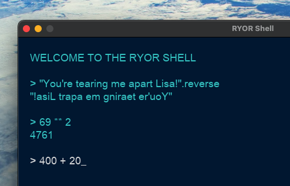

<br>

# Roll-Your-Own-Ruby

A front-end for the ruby interactive shell in a single ruby script.



<br>

## Pre-requisites

1. [Ruby](https://www.ruby-lang.org/en/)
2. [Ruby2d](https://www.ruby2d.com/)
3. [stringio](https://rubygems.org/gems/stringio/versions/0.0.1?locale=en)

<br>

## Three ways to run the script

<br>

### 1. with the ruby command

```
ruby ryor.rb
```

<br>

### 2. by giving permissions

give execution permissions with

```
chmod +x main.rb
```

then run the script directly with

```
./ryor.rb
```
<br>

### 3. by adding to the PATH variable

rename the file to remove the .rb extension (optional but conventional for executables)

```
mv ryor.rb ryor
```

Move the script to a directory in your PATH, such as /usr/local/bin (you may need sudo for this)

```
sudo mv main /usr/local/bin/
```

Then you can run the script from any directory with the command

```
ryor
```

<br>
